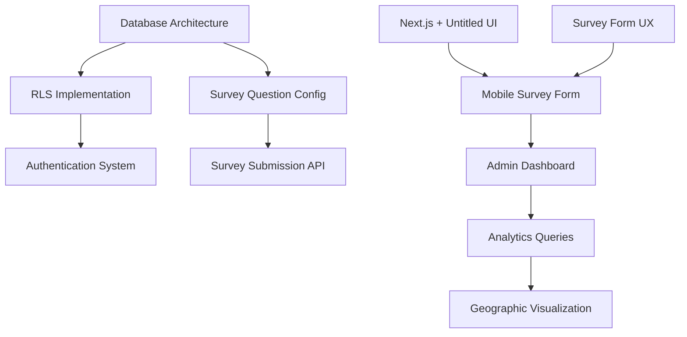

# PPD Candidate Polling Platform - Epic Overview

This directory contains the complete epic and user story breakdown for the PPD Candidate Polling Platform project.

## Epic Structure

### [Epic 1: Foundation Setup](./01-foundation-setup/) - 34 points
**Sprint 1 (Weeks 1-2)** | **Priority: High**

Establishes the technical foundation including database architecture, security policies, application framework, and authentication.

**Stories:**
- 1.1: Database Architecture Setup (8 pts) - 🗄️ Database Architect
- 1.2: Row Level Security Implementation (13 pts) - 🗄️ Database Architect  
- 1.3: Next.js Application with Untitled UI Setup (5 pts) - 🎨 Frontend Developer
- 1.4: Authentication System (8 pts) - ⚡ API Backend Engineer

---

### [Epic 2: Survey Data Collection](./02-survey-data-collection/) - 34 points
**Sprint 2 (Weeks 3-4)** | **Priority: High**

Implements the core survey functionality for field volunteers to collect voter data.

**Stories:**
- 2.1: Survey Question Configuration (5 pts) - 🗄️ Database Architect
- 2.2: Mobile Survey Form UI (13 pts) - 🎨 Frontend Developer
- 2.3: Survey Form UX Design (8 pts) - 🎯 UX Designer
- 2.4: Survey Submission API (8 pts) - ⚡ API Backend Engineer

---

### [Epic 3: Data Analytics Dashboard](./03-data-analytics/) - 34 points
**Sprint 3 (Weeks 5-6)** | **Priority: Medium**

Creates analytics and visualization capabilities for campaign insights.

**Stories:**
- 3.1: Admin Dashboard Layout (13 pts) - 🎨 Frontend Developer
- 3.2: Analytics Queries and Materialized Views (13 pts) - 📊 Data Analyst
- 3.3: Geographic Data Visualization (13 pts) - 📊 Data Analyst

---

### [Epic 4: User Management](./04-user-management/) - 16 points
**Sprint 4 (Weeks 7-8)** | **Priority: Medium**

Implements user administration and volunteer assignment features.

**Stories:**
- 4.1: User Role Management (8 pts) - 🎨 Frontend Developer
- 4.2: Volunteer Assignment System (8 pts) - ⚡ API Backend Engineer

---

### [Epic 5: Data Export and Reporting](./05-data-export/) - 8 points
**Sprint 4 (Weeks 7-8)** | **Priority: Low**

Provides data export capabilities for campaign follow-up activities.

**Stories:**
- 5.1: Voter Contact List Export (8 pts) - ⚡ API Backend Engineer

---

### [Epic 6: Security and Deployment](./06-security-deployment/) - 26 points
**Sprint 4 (Weeks 7-8)** | **Priority: High**

Ensures production readiness, security compliance, and deployment automation.

**Stories:**
- 6.1: Security Audit and Implementation (13 pts) - 🔒 DevOps & Security
- 6.2: Production Deployment Pipeline (13 pts) - 🔒 DevOps & Security

---

## Sprint Overview

| Sprint | Duration | Total Points | Focus |
|--------|----------|--------------|-------|
| Sprint 1 | Weeks 1-2 | 34 | Foundation Setup |
| Sprint 2 | Weeks 3-4 | 34 | Core Survey Features |
| Sprint 3 | Weeks 5-6 | 34 | Analytics & Dashboard |
| Sprint 4 | Weeks 7-8 | 50* | Polish & Deploy |

*Sprint 4 is intentionally over-capacity (50 points) to allow for prioritization decisions.

## Agent Workload Distribution

- 🗄️ **Database Architect**: 26 points (3 stories)
- 🎨 **Frontend Developer**: 47 points (4 stories)
- ⚡ **API Backend Engineer**: 32 points (4 stories)
- 🔒 **DevOps & Security**: 26 points (2 stories)
- 📊 **Data Analyst**: 26 points (2 stories)
- 🎯 **UX Designer**: 8 points (1 story)

## Key Dependencies

## Definition of Done Criteria

Each story must meet these criteria before completion:
- [ ] Acceptance criteria fully met
- [ ] Code reviewed by assigned agent
- [ ] Spanish language requirements met
- [ ] Mobile responsiveness verified
- [ ] Accessibility standards met (WCAG 2.1 AA)
- [ ] Security checklist completed
- [ ] Performance benchmarks met
- [ ] Integration tests passing
- [ ] Documentation updated

## Notes

- All user-facing text must be in Spanish
- Mobile-first design approach required
- Untitled UI React framework used for consistent components
- Security and data privacy are paramount
- Performance targets: < 2s page loads, 99.9% uptime